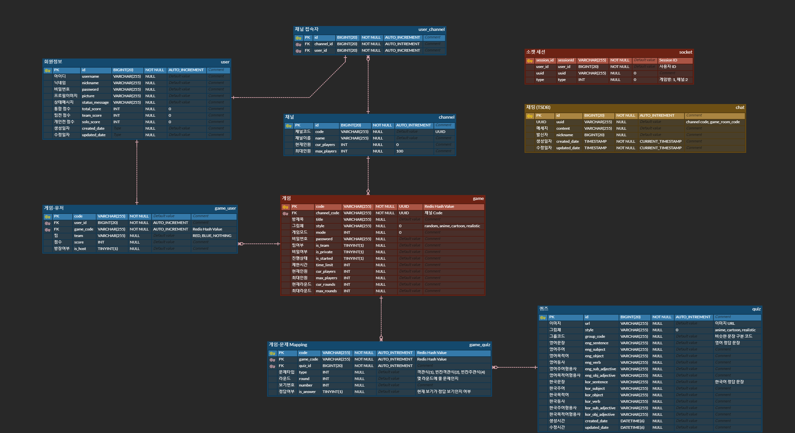
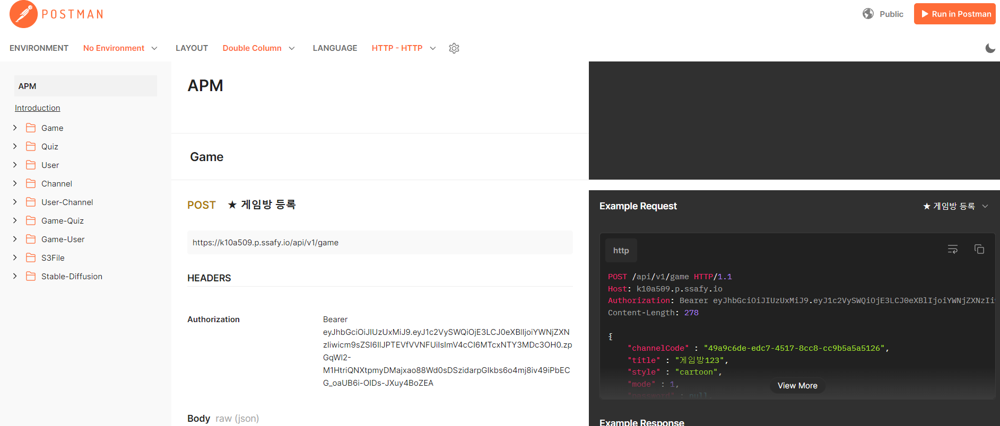
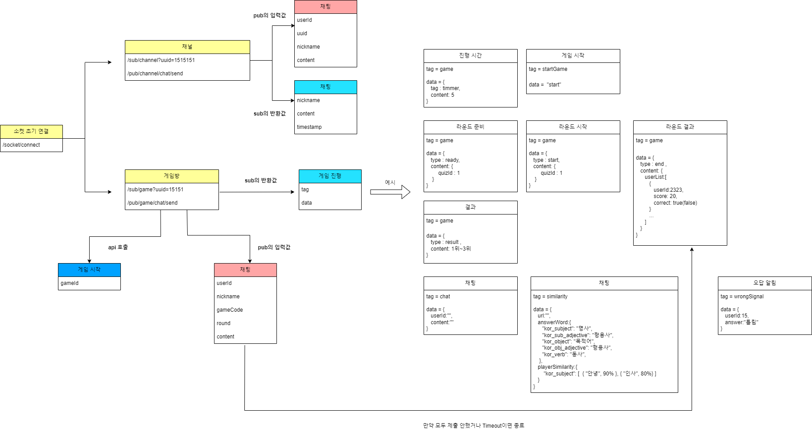
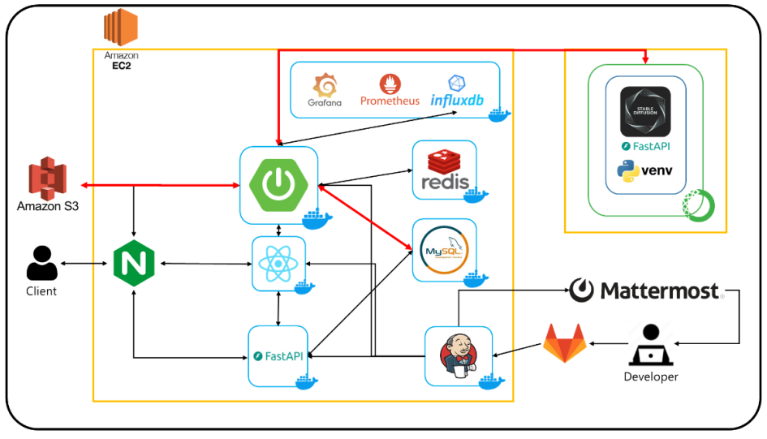
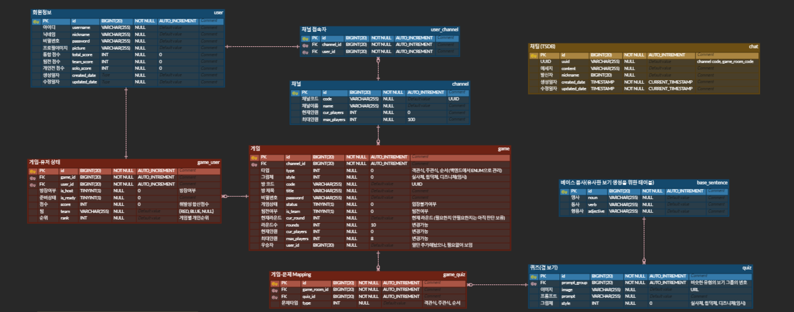

<div align='center'>
	
	
	
    
    
	
	   
       
	        
  	      
  	
	
	
</div>
<br/>


# :calendar: 기간
#### 2024.04.08~2024.05.17

# :sparkling_heart: 프로젝트 기획
- 현대 사회에서는 생성형 AI의 사용이 증가함에 따라 프롬프트 입력에 따라 생성되는 결과물이 매우 다양해지고 있습니다. 이에 따라 프롬프트 엔지니어링 교육도 확대되고 있으며, 프롬프트의 미묘한 차이를 이해하고 줄이는 기술이 중요시되고 있습니다.
- 이러한 사회적 흐름 속에서, 개발에 익숙하지 않은 사람들도 프롬프트의 세부적인 차이를 보다 쉽게 이해할 수 있도록 하는 게임 기반의 학습 플랫폼을 만들고자 해당 프로젝트를 기획했습니다.

# :two_hearts: 프로젝트 소개
- 사용자들이 실시간으로 함께 게임을 하면서 생성형 AI가 만든 이미지의 프롬프트를 맞출 수 있는 기능을 제공합니다.
- 게임은 객관식과 주관식 두 가지 유형으로 나뉘어 있습니다. 주관식 게임에서는 시간이 경과하면 초성 힌트가 제공되어 정답을 더 쉽게 유추할 수 있습니다. 또한 각 입력마다 유사도가 제공되어 정확도를 파악할 수 있습니다.
- 전체 사용자는 자신이 참여한 게임에서 랭킹 점수를 부여받을 수 있으며 개인 점수에 따른 순위를 확인할 수 있습니다. 
- 실시간 채팅을 통해 단순히 혼자 즐기는 것이 아니라 다른 사용자들과 함께 소통하며 게임을 진행하는 것이 가능합니다.


# :runner: 개발 인원
| **서다찬 (팀장)** | **김영욱** | **조시훈** | **서해광** | **유지웅** | **이민우** |
| :------: |  :------: |  :------: |  :------: |  :------: |  :------: |
|  <br/> **백엔드** | <br/> **백엔드** |  <br/> **백엔드 & 인프라** | <br/>  **백엔드** |  <br/> **프론트엔드** |  <br/> **프론트엔드 & 백엔드** | 


# :yellow_heart: 개발 환경

- Front : React, TypeScript 
- Back-end : Spring Boot, JPA, FastAPI, Uvicorn, Mysql, InfluxDB, Redis
- 버전관리 : Gitlab
- 협업 툴 : Notion, Jira
- 배포 : Jenkins, Docker
- 모니터링 : Grafana, Prometheus
<br>

# 빌드 방법

## 1. Spring Boot
- 빌드
```
$ ./gredlew build
```
- 실행
```
$ java -jar build.jar
```


## 2. FastAPI
- 패키지 다운로드
```
$ pip install -r requirements.txt
```
- 실행
```
$ uvicorn chatdaAPI.main.app:app --host 0.0.0.0 --reload
```

## 3. React
- 패키지 다운로드
```
$ npm i
```
- 빌드
```
$ npm run build
```

# :green_heart: 커밋 컨벤션
| prefix |  설명 |   
|---|----|
|feat | 새로운 기능 추가|   
|fix | 버그 수정|
|docs | 문서 수정|
|style | 코드 포맷팅, 세미콜론 누락, 코드 변경이 없는 경우|
|refactor | 코드 리펙토링|
|test | 테스트 코드, 리펙토링 테스트 코드 추가|
|chore | 빌드 업무 수정, 패키지 매니저 수정|
|etc | 기타 업무 |

# 💜ERD    
   


# 🖤API 명세서
#### [Postman](https://documenter.getpostman.com/view/34459551/2sA3JQ3z94)


# :yellow_heart: 소켓 연결 Dto


# :green_heart: 프로젝트 구조


# :yellow_heart: 기능별 소개
### 로그인


### 채팅


### 게임방 생성


### 객관식


### 시작


### 주관식


### 라운드 준비 타이머


# 💙 버그 리포트

## 1. DB 최적화
- 초기 프로젝트 설계시 게임과 관련된 데이터는 Redis로 관리하며 조회 속도를 향상시키고 일정 시간이 지났을때 삭제가 될 수 있도록 설계를 했습니다.
- 하지만 Redis에 저장된 데이터를 조회를 함에 있어 Key-value가 아닌 별도의 Indexed를 통해 컬럼을 지정해서 조회해야하는 상황이 늘어났고 해당 문제 때문에 게임방 생성 시간이 지연되는 문제가 발생했습니다.
- 게임을 진행하면서 필요한 퀴즈 데이터를 저장함에 있어 한 게임에 많게는 200개의 퀴즈 데이터를 저장해야 하기 때문에 기존 insert시간은 200개 기준 50초의 시간이 걸렸습니다. 



- 해당 문제를 해결하기 위해서 기존에 Redis로 저장한 데이터 중 RDB로 관리가 가능한 데이터들은 RDB로 분리를 시켜 데이터 베이스 최적화 작업을 수행했습니다.
- 이로써 200개의 데이터를 저장할때 기존 50초의 시간이 2초의 시간으로 감소하는 이점을 가져올 수 있었습니다.


- 초기에는 Redis로 관리하는 데이터는 Memory에서 직접 관리하기에 무조건적으로 빠를 것이라 예상했었지만 관계가 있는 데이터를 관리할때는 RDB를 사용하는 것이 성능적으로 우수하다는 것을 깨달을 수 있었습니다.


## 2. 소켓 세션 관리
- 소켓 연결과 관련한 데이터를 관리하며 기존에는 프론트엔드에서 disconnect() 함수만으로 연결이 끊겼을때 기존 세션 값을 삭제하는 방식으로 관리를 했습니다.
- 하지만 만약 소켓 연결이 비정상적으로 종료되는 경우(새로고침, 창닫기) 이러한 disconnect함수가 호출되지 않는 경우가 발생해 세션 정보가 남아있는 오류가 발생했습니다.

```
  public disconnect(): void {
    if (this.client !== null) {
      this.client.deactivate();
      console.log('WebSocket disconnected');
    }
  }

  ```
- 때문에 기본 세션 연결을 처음 시도할때 랜덤하게 발급되는 sessionID와 userId를 매핑한 테이블을 생성하고 사용자의 동작(게임방 입장, 채널 입장 등)에 따라 세션 상태를 관리할 수 있도록 Spring에서 event listener를 구현했습니다.
```
    @EventListener
    public void handleWebSocketConnectListener(SessionConnectedEvent event) {
        logger.info("Received a new web socket connection(event: " + event + ")");

        String sessionId = parsingSessionIdFromEvent(event);
        socketService.addSession(sessionId);
    }

    @EventListener
    public void handleWebSocketSubscribeListener(SessionSubscribeEvent event) {
        logger.info("Received a new web socket subscribe(event: " + event + ")");

        String sessionId = parsingSessionIdFromEvent(event);
        SocketEventUrlParser parser = new SocketEventUrlParser(parsingUrlFromEvent(event));

        if (parser.isOk()) {
            socketService.editSession(sessionId, parseUserId(event), parser.getUuid(), parser.getType());

        } else {
            logger.info("destination format does not match.");
        }
    }

    @EventListener
    public void handleWebSocketDisconnectListener(SessionDisconnectEvent event) {
        logger.info("Received a web socket disconnection(event: " + event + ")");
        try{
            String sessionId = parsingSessionIdFromEvent(event);
            socketService.kickOutUser(sessionId);
            socketService.deleteSession(sessionId);

        }catch (Exception e){
            logger.debug("Socket Disconnect Exception : " + e.getMessage());
        }
    }
```

